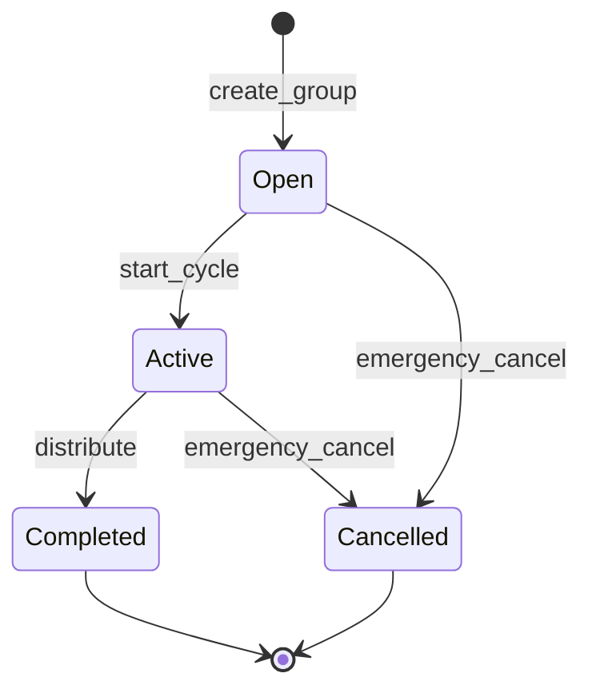
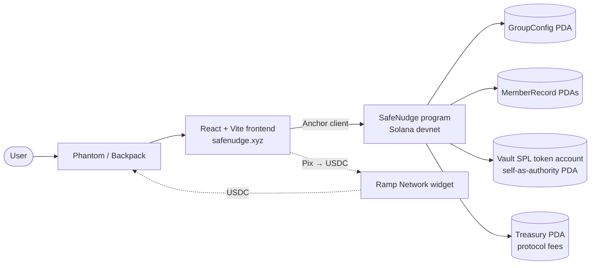
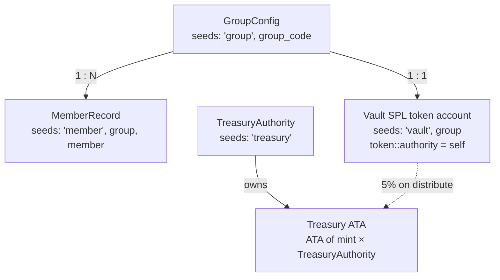

# SafeNudge

**Group accountability savings on Solana — built for Brazilian caixinhas, MOAIs, and vaquinhas.**

[](https://github.com/davigiroux/safenudge.xyz/actions/workflows/ci.yml)
[](https://explorer.solana.com/?cluster=devnet)
[](https://www.anchor-lang.com/)

SafeNudge is a digital MOAI with better rules: friends commit to recurring deposits in a shared on-chain vault, missed deposits trigger penalties, and those penalties get redistributed to the members who stayed consistent. No administrator, no trust required, no 15–20% consórcio fees. The blockchain handles the rules. The group handles the motivation.

---

## The Concept

### The problem

Brazilians don't have a savings problem. They have an **enforcement problem**. Millions already save in informal groups — MOAIs, caixinhas, vaquinhas — because group commitment achieves what individual willpower cannot. But these groups break in predictable ways: someone holds the money and disappears, deposits get missed without consequence, and the formalised version (consórcios) charges 15–20% in administrator fees.

### The solution

SafeNudge replaces the trust layer of a savings group with a smart contract. A creator sets the rules (deposit amount, frequency, penalty for misses). Members join with an invite code, lock in their first deposit, and the cycle begins. Missed deposits trigger penalties at distribution time, redistributed pro-rata to consistent members. Everyone gets their money back at the end — adjusted for what they earned or owed.

### Why it's better than a traditional MOAI

- **No trust required.** Code enforces the rules, not a person.
- **No administrator fees.** A flat 5% protocol fee on the *penalty pool* — never on principal.
- **Positive incentives.** Consistent savers earn more than just their money back.
- **Transparent.** Every deposit, every miss, every penalty is on-chain and auditable.
- **Portable.** Join from a shareable link — not limited to people you know in person.

→ Read the full story in [`CONCEPT.md`](./CONCEPT.md).

---

## How It Works

A group moves through six lifecycle moments. The creator sets the rules; everything else is permissionless.

1. **Create** — Creator picks deposit amount, frequency, total periods, max members, and penalty config.
2. **Join** — Members join via a shareable code and make their first deposit (skin in the game).
3. **Start** — Creator locks the group; cycle begins, no new members.
4. **Deposit** — Each period, members deposit the fixed amount. The program tracks who shows up and who doesn't.
5. **Distribute** — After the final period, anyone can trigger settlement. Penalties redistribute to compliant members; protocol takes 5% of the penalty pool; vault closes.
6. **Emergency cancel** — At any time before completion, the creator can return everyone's deposits pro-rata, no penalties applied.

### Group lifecycle



`join_group` happens repeatedly while the group is `Open`; `deposit` happens repeatedly while the group is `Active`. Both keep the group in its current state, so they're not drawn as transitions. `distribute` can only fire once the cycle's full duration has elapsed.

### Penalty mechanics

Penalties are the behavioural core. They're configurable per group as either a **fixed amount** (e.g., 2 USDC per missed period) or a **percentage** of the deposit (basis points). Three guarantees:

- **Capped.** A member can never lose more than they deposited (`penalty = min(penalty, total_deposited)`).
- **Settled at the end.** No mid-cycle fund movement; cleaner program logic, lower transaction count.
- **Redistributed.** Collected penalties are split equally among members with zero misses, after a 5% protocol fee.

---

## Architecture

### System



### Accounts and PDAs



GroupConfig is the hub. Every MemberRecord points back to it via `has_one`. The vault is a single SPL token account whose **address and authority are the same PDA** — no human key is ever the authority on the vault. The Treasury is a singleton, shared across every group on the cluster, drained only by the compile-time `FEE_RECIPIENT`.

### Instruction set

| Instruction | Who can call | Fund movement | Required status |
|---|---|---|---|
| `create_group` | Anyone (signer pays rent) | None | — |
| `join_group` | Anyone (becomes member) | Member → Vault | Open |
| `start_cycle` | Creator only | None | Open |
| `deposit` | Members only | Member → Vault | Active |
| `distribute` | Anyone (permissionless) | Vault → Members + Treasury | Active (cycle ended) |
| `emergency_cancel` | Creator only | Vault → Members (pro-rata) | Open or Active |
| `withdraw_fees` | Compile-time `FEE_RECIPIENT` only | Treasury → Recipient | — |

### Tech stack

| Layer | Choice | Version / Notes |
|---|---|---|
| Program | Rust + Anchor | Anchor 1.0.2, `overflow-checks = true` in release profile |
| Token | USDC (SPL Token) | Devnet mint configurable via `VITE_USDC_MINT` |
| Frontend | React + TypeScript + Vite | Strict TS, Tailwind, react-router-dom |
| Wallet | `@solana/wallet-adapter-react` | Phantom + Backpack |
| Anchor client | `@coral-xyz/anchor` | 0.32.x in workspace |
| Localisation | `i18next` + `react-i18next` | PT-BR default, EN fallback |
| On-ramp | `@ramp-network/ramp-instant-sdk` | Pix → USDC, in progress |
| Tests | LiteSVM (in-process) + ts-mocha | No live RPC needed |
| CI | GitHub Actions | Anchor build/test, tsc, build, security-lint, audits |
| Hosting | Vercel | Auto-deploy from `main` |

→ Read the full architecture in [`ARCHITECTURE.md`](./ARCHITECTURE.md).

---

## Security Model

SafeNudge holds user funds. The security posture is structural, not bolted on. Six non-negotiables:

1. **No admin backdoors.** No upgrade-authority instruction, no admin withdrawal, no owner override.
2. **PDA-only authority on the vault.** No human wallet can ever sign a transfer out of the vault.
3. **One-directional state machine.** Status moves `Open → Active → Completed/Cancelled`. Every instruction validates status as its first check; nothing can revert.
4. **Capped penalty math.** A member can never owe more than they deposited. All numeric ops use `checked_add/sub/mul/div` — raw arithmetic on `u64` is forbidden and CI-enforced.
5. **Permissionless distribution.** Anyone can settle a finished cycle. No single party can hold funds hostage.
6. **`transfer_checked` everywhere.** Mint and decimals are validated at the CPI level — no token-confusion attacks.

The Drift Protocol exploit of April 2026 ($285M, 12 minutes) didn't exploit a code bug — it abused an admin key, durable nonces, and oracle manipulation. SafeNudge's attack surface is smaller (no oracles, no governance, no upgrade authority), but the *principle* is the same: correctness lives in the constraints, not just the code paths.

→ Threat model, instruction matrix, and constraint templates in [`ARCHITECTURE.md`](./ARCHITECTURE.md#security-architecture). Engineering rules and forbidden patterns in [`CLAUDE.md`](./CLAUDE.md#security-principles).

---

## Project Structure

```
safenudge.xyz/
├── programs/safenudge/src/
│   ├── lib.rs                    # Program entry, instruction routing, FEE_RECIPIENT consts
│   ├── instructions/             # One file per instruction
│   │   ├── create_group.rs
│   │   ├── join_group.rs
│   │   ├── start_cycle.rs
│   │   ├── deposit.rs
│   │   ├── distribute.rs
│   │   ├── emergency_cancel.rs
│   │   └── withdraw_fees.rs
│   ├── state/                    # Account struct definitions
│   │   ├── group_config.rs
│   │   └── member_record.rs
│   └── errors.rs                 # SafeNudgeError enum
├── tests/safenudge.ts            # LiteSVM integration tests (TypeScript)
├── app/                          # React frontend
│   ├── src/
│   │   ├── pages/                # Landing, ComoFunciona, CreateGroup, JoinGroup, GroupDashboard, MyGroups
│   │   ├── components/           # Button, Card, NudgeToast, WalletProvider, …
│   │   ├── hooks/                # useAnchorProgram, useGroupConfig, useMemberRecord, …
│   │   ├── i18n/                 # PT-BR + EN translations
│   │   ├── idl/                  # Auto-generated from `anchor build`
│   │   └── utils/
│   ├── package.json
│   └── vite.config.ts
├── docs/
│   ├── design-system.md          # SafeNudge Bossa — Organic Trust Framework
│   ├── design-tokens.json        # Material Design 3 tokens
│   └── screens/                  # Reference designs
├── .github/workflows/ci.yml
├── Anchor.toml
├── Cargo.toml
├── CONCEPT.md                    # Product rationale, market, revenue
├── ARCHITECTURE.md               # Account layouts, instructions, security
├── ROADMAP.md                    # Operational view: shipped / in flight / next
├── CLAUDE.md                     # Engineering rules and agent-role discipline
└── README.md                     # You are here
```

One instruction per file in `programs/safenudge/src/instructions/`. One page per file in `app/src/pages/`. One state struct per file in `state/`.

---

## Quickstart

### Prerequisites

| Tool | Version | Install |
|---|---|---|
| Rust | stable | `curl --proto '=https' --tlsv1.2 -sSf https://sh.rustup.rs \| sh` |
| Solana CLI | v3.1.10 | `sh -c "$(curl -sSfL https://release.anza.xyz/v3.1.10/install)"` |
| Anchor CLI | 1.0.2 | `cargo install --git https://github.com/coral-xyz/anchor --tag v1.0.2 anchor-cli --locked` |
| Node.js | 24 | `nvm install 24 && nvm use 24` |

Node 24 is required: Node 20 and 22 ship a V8 build with a pretenuring-handler bug that crashes the LiteSVM test suite mid-run.

### Build and test the program

```bash
anchor build
anchor test
# or, equivalently, the LiteSVM in-process runner:
npx ts-mocha -p ./tsconfig.json -t 1000000 tests/**/*.ts
```

Per-cluster builds for the protocol fee recipient:

```bash
anchor build                              # local / test fallback recipient
anchor build -- --features devnet         # devnet recipient
anchor build -- --features mainnet        # mainnet placeholder (issue #20)
```

### Run the frontend

```bash
cd app
npm install
npm run dev
```

Type-check and production build:

```bash
cd app
npx tsc --noEmit
npm run build
```

### Frontend environment

Create `app/.env` (never committed):

| Variable | Purpose |
|---|---|
| `VITE_SOLANA_RPC_URL` | RPC endpoint (devnet: `https://api.devnet.solana.com`) |
| `VITE_PROGRAM_ID` | Deployed program ID — defaults to the `declare_id!` value |
| `VITE_USDC_MINT` | USDC mint on the target cluster |
| `VITE_RAMP_API_KEY` | Ramp Network API key for the Pix on-ramp |

---

## Development and CI

### Agent-role discipline

The codebase is developed under four explicit agent roles, each with its own scope, rules, and pre-commit checklist:

- **Program Engineer** — `programs/safenudge/src/` and `tests/`
- **Frontend Engineer** — `app/src/`
- **Test Engineer** — `tests/`
- **Security Reviewer** — final gate on every PR touching the program

Full rules, forbidden patterns, and the Drift-derived security checklist live in [`CLAUDE.md`](./CLAUDE.md#agent-roles).

### CI pipeline

[`.github/workflows/ci.yml`](./.github/workflows/ci.yml) runs four jobs on every push and PR:

| Job | What it checks |
|---|---|
| `program` | `anchor build --ignore-keys` then the LiteSVM test suite (in-process, no RPC) |
| `frontend` | `tsc --noEmit` and `vite build` against the `app/` workspace |
| `security-lint` | Greps for raw arithmetic in program code, hardcoded UI strings, and committed secrets |
| `audit` | `cargo audit` and `npm audit` (advisory — failures don't block merges) |

### Branch and commit conventions

Branch names: `feat/<scope>`, `fix/<scope>`, `test/<scope>`, `security/<scope>`. Commit subjects use `feat(program): …`, `feat(frontend): …`, `fix(program): …`, etc. Every PR carries a security-impact note and a completed checklist for the relevant agent role. Full conventions in [`CLAUDE.md`](./CLAUDE.md#git-workflow).

---

## Roadmap Snapshot

| Phase | Status | What ships |
|---|---|---|
| **MVP** (May 2026) | in flight | Core program, React frontend, PT-BR/EN i18n, devnet deploy, Ramp on-ramp |
| **v1.1** — Protocol fee | in flight | 5% fee on penalty pool, treasury PDA, `withdraw_fees` |
| **v2** — Yield integration | planned | Kamino K-Lend during active cycles, performance fee, premium tier |
| **v3** — Mainstream onboarding | planned | Embedded wallets, full Pix on/off-ramp, WhatsApp notifications |
| **v4** — Game modes | planned | Consórcio mode, challenge mode, streak bonuses, B2B white-label |

→ Full task breakdown and shipped/in-flight detail in [`ROADMAP.md`](./ROADMAP.md).

---

## Documentation

- [`CONCEPT.md`](./CONCEPT.md) — Product rationale, target user, market sizing, revenue model, GTM
- [`ARCHITECTURE.md`](./ARCHITECTURE.md) — Account layouts, instruction specs, PDA derivation, security architecture
- [`ROADMAP.md`](./ROADMAP.md) — Operational view: what's shipped, what's in flight, what's next
- [`CLAUDE.md`](./CLAUDE.md) — Engineering rules, agent-role discipline, forbidden patterns, CI contract
- [`docs/design-system.md`](./docs/design-system.md) — SafeNudge Bossa: the Organic Trust Framework
- [`docs/design-tokens.json`](./docs/design-tokens.json) — Material Design 3 tokens (colour, type, elevation)

---

## License

No license file is checked in yet. Until one is added, treat this repository as **all rights reserved** by the author. Open-sourcing the protocol is on the table for v2 and will be tracked as a separate decision.

## Author

Davi Giroux — 2026.
